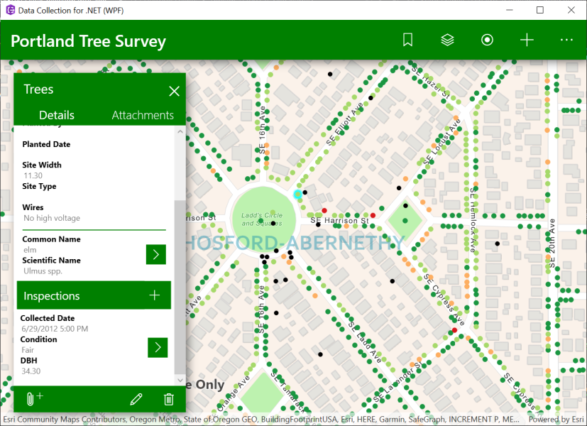

# Data Collection .NET

<!-- MDTOC maxdepth:6 firsth1:0 numbering:0 flatten:0 bullets:1 updateOnSave:1 -->

- [Features](#features)   
- [Best practices](#best-practices)   
- [Detailed Documentation](#detailed-documentation)   
- [Get started](#get-started)   
   - [Fork the repo](#fork-the-repo)   
   - [Clone the repo](#clone-the-repo)   
      - [Command line Git](#command-line-git)   
   - [Configuring a Remote for a Fork](#configuring-a-remote-for-a-fork)   
   - [Configure the app](#configure-the-app)   
      - [1. Register an application](#1-register-an-application)   
      - [2. Configure the project](#2-configure-the-project)   
- [Learn more](#learn-more)   
- [Requirements](#requirements)   
- [Contribute](#contribute)   
- [MDTOC](#mdtoc)   
- [License](#license)   
   - [3rd-party component licensing](#3rd-party-component-licensing)   

<!-- /MDTOC -->
---

Data Collection for .NET shows how a robust application can be built with the ArcGIS Platform using the ArcGIS Runtime SDK for .NET, WPF, and UWP. It demonstrates best practices around some simple but key functionality of the ArcGIS Runtime. Using your organization's web maps, you can use Data Collection as-is, or extend it to meet your specific needs.

## Features

* Take your web map and data offline
* Edit your data both offline and online
* Synchronize offline edits
* View and edit your data with Popups
* Work with Features, Popups, Attachments, and PopupManager
* Edit and query Feature Tables
* Work with related records
* Identify map features
* Authenticate with Portal using OAuth
* Use the World Geocoder service
* Use Popup configuration to drive app behavior
* Navigate to bookmarks defined in the web map
* Show and hide layers with a table of contents
* View symbology for layers in the map with a legend

## Best practices

The project also demonstrates some patterns for building real-world apps around the ArcGIS Runtime SDK.

* Map-centric UI design
* ArcGIS asynchronous service pattern
* Cross-platform application design
* Model-View-ViewModel pattern

## Detailed Documentation

Read the [docs](./docs/README.md) for a detailed explanation of the application, including its architecture and how it leverages the ArcGIS platform, as well as how you can begin using the app right away.

## Get started

You will need [Visual Studio 2017](https://visualstudio.microsoft.com/downloads/) or later (2019 or later is recommended).

### Fork the repo

**Fork** the [Data Collection](https://github.com/Esri/data-collection-dotnet/fork) repo.

### Clone the repo

Once you have forked the repo, you can make a clone and open `DataCollection.sln` in Visual Studio.

#### Command line Git

1. [Clone Data Collection](https://help.github.com/articles/fork-a-repo/#step-2-create-a-local-clone-of-your-fork)
2. `cd` into into the cloned repository's directory
3. Make your changes and create a [pull request](https://help.github.com/articles/creating-a-pull-request)

### Configuring a Remote for a Fork

If you make changes in the fork and would like to [sync](https://help.github.com/articles/syncing-a-fork/) those changes with the upstream repository, you must first [configure the remote](https://help.github.com/articles/configuring-a-remote-for-a-fork/). This will be required when you have created local branches and would like to make a [pull request](https://help.github.com/articles/creating-a-pull-request) to your upstream branch.

1. In the Terminal (for Mac users) or command prompt (for Windows and Linux users) type `git remote -v` to list the current configured remote repo for your fork.
2. `git remote add upstream https://github.com/Esri/data-collection-dotnet.git` to specify new remote upstream repository that will be synced with the fork. You can type `git remote -v` to verify the new upstream.

If there are changes made in the original repository, you can sync the fork to keep it updated with upstream repository.

1. In the terminal, change the current working directory to your local project
2. Type `git fetch upstream` to fetch the commits from the upstream repository
3. `git checkout master` to checkout your fork's local master branch.
4. `git merge upstream/master` to sync your local `master` branch with `upstream/master`. **Note**: Your local changes will be retained and your fork's master branch will be in sync with the upstream repository.

### Configure the app

The app can be run as-is, but it's recommended you do some configuration to set up OAuth to be relevant to your users. At minimum, the app should not be deployed without these changes:

1. Register an ArcGIS Portal Application.
2. Configure Data Collection project to reference that application.
3. License the app to remove the Developer Mode watermark and for deployment.

#### 1. Register an application

For OAuth configuration, create a new Application in your ArcGIS Portal to obtain a `Client ID` and configure a `Redirect URL`. The **Client ID** configures the ArcGIS Runtime to show your users, during the login process, that the application was built by you and can be trusted. The **Redirect URL** configures the OAuth process to then return to your app once authentication is complete.

1. Log in to [https://developers.arcgis.com](https://developers.arcgis.com) with either your ArcGIS Organizational Account or an ArcGIS Developer Account.
2. Register a new Application, following the instructions in [Register your applications](https://developers.arcgis.com/documentation/security-and-authentication/oauth-2.0/register-your-application/).
3. Note the **Client ID** and add a **Redirect URL**, e.g. `data-collection://auth`. You will use these values in the **Configuring the project** section below.

#### 2. Configure the project

1. Open the solution in Visual Studio and browse to the file named `Configuration.xml` located in the `Properties` directory of the  `DataCollection.Shared` project.
2. _(Optionally)_ configure the `WebmapURL` to match your organization's webmap.
3. Configure the OAuth Redirect URL.
    * Set the `RedirectURL` property to match the **Redirect URL** you have set up when you registered your application (see section above).
4. Configure the Client ID.
    * Set the `ClientID` property with the **Client ID** generated when you registered your application (see section above).

## Learn more

Learn more about Esri Open Source Apps [here](https://developers.arcgis.com/documentation/app-templates-and-builders/open-source-apps/).

## Requirements

* [Visual Studio 2017](https://visualstudio.microsoft.com/downloads/) or later
  * Visual Studio 2019 is required if you want to use the .NET Core version of the WPF app.
* [ArcGIS Runtime SDK for .NET](https://developers.arcgis.com/downloads/)
* To edit records or take a web map offline you will need an ArcGIS Online Organizational account, an ArcGIS Online Developer account, or an ArcGIS Online account authenticated using a social login.
* To consume your own web map you will need an ArcGIS Online Organizational account.

## Contribute

Anyone and everyone is welcome to [contribute](https://github.com/esri/contributing). We do accept pull requests.

1. Get involved
2. Report issues
3. Contribute code
4. Improve documentation

## MDTOC

Generating table of contents for documents in this repository was performed using the [MDTOC package for Atom](https://atom.io/packages/atom-mdtoc).

## License

Copyright 2020 Esri

Licensed under the Apache License, Version 2.0 (the "License"); you may not use this file except in compliance with the License. You may obtain a copy of the License at

[https://www.apache.org/licenses/LICENSE-2.0](https://www.apache.org/licenses/LICENSE-2.0)

Unless required by applicable law or agreed to in writing, software distributed under the License is distributed on an "AS IS" BASIS, WITHOUT WARRANTIES OR CONDITIONS OF ANY KIND, either express or implied. See the License for the specific language governing permissions and limitations under the License.

A copy of the license is available in the repository's [LICENSE](LICENSE) file.

For information about licensing your deployed app, see [License your app](https://developers.arcgis.com/net/license-and-deployment/license/).

### 3rd-party component licensing

This project uses the following 3rd-party components:

* [Humanizer](https://github.com/Humanizr/Humanizer) - [MIT License](https://github.com/Humanizr/Humanizer/blob/master/LICENSE)
* [Windows UI Library 2](https://github.com/microsoft/microsoft-ui-xaml) - [Microsoft License](https://www.nuget.org/packages/Microsoft.UI.Xaml/2.3.200213001/license)
* [XamlBehaviors for WPF](https://github.com/Microsoft/XamlBehaviorsWpf) - [MIT License](https://github.com/microsoft/XamlBehaviorsWpf/blob/master/LICENSE)
* [ControlzEx](https://github.com/ControlzEx/ControlzEx) - [MIT License](https://github.com/ControlzEx/ControlzEx/blob/develop/LICENSE)
* [NUnit 3](https://nunit.org/) - [MIT License](https://github.com/nunit/nunit/blob/master/LICENSE.txt)
* [NUnit 3 VS Test Adapter](https://github.com/nunit/nunit3-vs-adapter) - [MIT License](https://github.com/nunit/nunit3-vs-adapter/blob/master/LICENSE.txt)